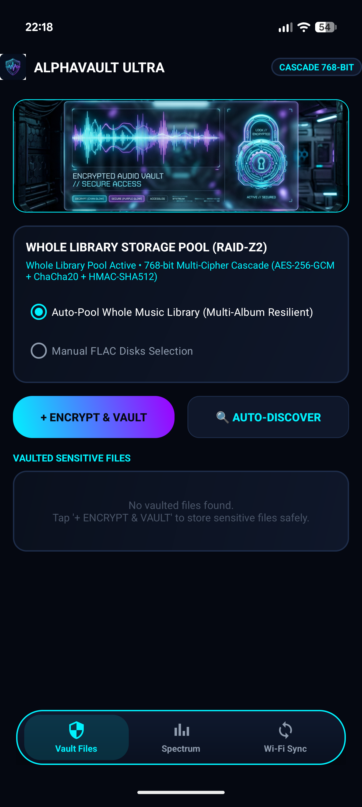

<h1 align="center">
  <br>
  AlphaVault Ultra ZFS
  <br>
  <sub><em>an upgraded fork of <a href="https://github.com/bennjordan/AlphaSteg">AlphaSteg</a> that turns a FLAC library into a fault-tolerant vault</em></sub>
  <br>
</h1>

<p align="center">
  <a href="https://github.com/sworrl/AlphaVault-Ultra-ZFS"></a>
</p>

<p align="center">
  
  
  
  
  
</p>

<p align="center">
  
  
  
  
</p>

---

A one-terabyte FLAC library is thousands of 16-bit samples per second that nobody inspects at the bit level. AlphaVault hides encrypted files in the least-significant bit of those samples, spreads the pieces across many tracks with parity, and mirrors every piece to a second track. Delete an album, corrupt a track, or swap out a disk, and the hidden file still reassembles.

This repository is a fork of [bennjordan/AlphaSteg](https://github.com/bennjordan/AlphaSteg). The upstream project is a desktop steganography server. This fork keeps that server and adds a native Kotlin Android app plus a heavier crypto and storage layer. What each half does, and exactly where they differ, is spelled out below.

> **Early development.** This is a work in progress. Read [Status: what works and what does not](#status-what-works-and-what-does-not) before assuming any feature is finished. Right now the app launches, syncs the FLAC library, and shows storage; the encryption, RAID, and steganography engines are written but not yet verified end to end.

## Contents

- [Status: what works and what does not](#status-what-works-and-what-does-not)
- [What the fork adds](#what-the-fork-adds)
- [Two halves, one repo](#two-halves-one-repo)
- [The Android app](#the-android-app)
- [Cascade encryption, layer by layer](#cascade-encryption-layer-by-layer)
- [RAID-Z2 storage and what it actually recovers](#raid-z2-storage-and-what-it-actually-recovers)
- [Build the APK](#build-the-apk)
- [Run the desktop server](#run-the-desktop-server)
- [Security notes, stated plainly](#security-notes-stated-plainly)
- [Roadmap](#roadmap)
- [Project layout](#project-layout)
- [Fork attribution and license](#fork-attribution-and-license)

## Status: what works and what does not

Verified on a Pixel-class device running Android 14, and by unit tests where noted. Everything else in this README describes code that exists in the repo but has not been run end to end.

**Tested and working** (13 unit tests pass; the carrier engine is also verified against a real device FLAC)

- Build, install, and launch through the lock screen into the main UI, with a full-bleed adaptive launcher icon.
- Navigation split the way the app is meant to be used: a **Vault** tab showing only the hidden files, and a separate **Disks** tab (a RAID-manager view: storage bar, pool stats, sync, and the FLAC carriers).
- FLAC library sync. On startup, on resume, and on a manual **Sync Library** tap, the app scans the standard media folders for `.flac` files. Verified with 24 tracks across two albums.
- Three-tier storage view: whole-device usage, the music pool that forms the vault, and granular vault usage.
- The vault as a filesystem inside the FLAC library. A file is cascade-encrypted, split into RAID-Z2 chunks, and each chunk is embedded in a real FLAC as an APPLICATION metadata block, spread across albums so a chunk and its mirror never share one album. The audio frames are left byte-identical, so tracks still play. An encrypted, CRC-checksummed index (replicated like a GPT/uberblock) lives in the carriers too; there is no app-private database. Restore self-heals: a corrupt or missing chunk is rebuilt from parity or its mirror.
- What the tests prove: round-trip vault and restore; audio bytes unchanged after embedding; a whole album deleted from the library and the file still restores; a corrupted chunk detected by CRC and rebuilt; the index generation counter; a wrong password reading as an empty vault.
- Multiple passcodes, multiple compartments. Different codes open different vaults in the same FLAC volume; saving one compartment's index leaves the others untouched.
- Secure in-app viewer: decrypt into memory and view images, text, and audio (played from RAM) without writing plaintext to disk.
- Lock screen: hex codes (0-9, a-f), minimum 8, with a mandatory master and duress code set at onboarding. The duress code wipes stored credentials and strips every vault block from the carriers.
- Hardening: `FLAG_SECURE` on all screens (no screenshots, screen recording, or recents thumbnails), backups disabled, cleartext traffic disabled.

**Written but not yet verified end to end**

- The Android **Wi-Fi Sync** switch starts a foreground service with a notification; there is no HTTP server behind it yet.
- The spectrum visualizer draws, but it is decorative and not tied to real audio.

See [Roadmap](#roadmap) for features that are planned but not started.

## What the fork adds

Upstream AlphaSteg is a Python FastAPI server that encodes and decodes payloads in audio using LSB and multi-frequency shift keying (MFSK), with AES-256-GCM as the single cipher. This fork leaves that server in place and builds on top of it:

| Capability | Upstream AlphaSteg | AlphaVault Ultra ZFS |
|---|---|---|
| Encryption | AES-256-GCM, one layer | AES-256-GCM then ChaCha20-Poly1305, with an outer HMAC-SHA512 tag |
| Key derivation | PBKDF2-HMAC-SHA256, 50,000 iterations | PBKDF2-HMAC-SHA512, 500,000 iterations, 768-bit output |
| Storage model | one carrier per payload | payload split into 4 data chunks + P/Q parity, then mirrored to hot spares |
| Native client | none (browser UI over the server) | Kotlin Android app, 8 source files, 6.3 MB APK |
| Lock screen | none | biometric unlock, randomized keypad, decoy PIN |

The Android app carries its own Kotlin implementation of the cascade cipher and the RAID layer. It does not call the Python server; the two are independent.

## Two halves, one repo

**Desktop server** (`main.py`, `static/`). FastAPI on `127.0.0.1:8000`, started with `python main.py`. It resolves audio URLs through yt-dlp, streams carriers, and encodes or decodes payloads by LSB or MFSK. MFSK uses eight tones from 10,000 to 11,400 Hz in the standard and balanced presets, and a sixteen-tone bank from 8,000 to 11,300 Hz in the fast preset; decoding runs a Goertzel filter per tone. Encryption here is AES-256-GCM with a `PBKDF2-HMAC-SHA256` key at 50,000 iterations. Payloads carry an `AESA` magic prefix.

**Android app** (`android/`). A native Kotlin app with no Python runtime. It hides files in FLAC sample LSBs, encrypts with the 768-bit cascade, and distributes chunks with parity and hot-spare mirroring. This is the half most of this README is about.

## The Android app

<p align="center">
  
</p>

The app opens on a lock screen and, once unlocked, shows three panels behind a floating navigation dock.

**Lock screen** (`LockScreenActivity`). On first run it asks you to set a master PIN and derives a decoy PIN from it. On later runs it offers biometric unlock through `androidx.biometric` when the device has an enrolled fingerprint or face, and falls back to the PIN. The keypad reshuffles its digits after every keypress so shoulder-surfers and screen-grease patterns give nothing away. Entering the decoy PIN unlocks the app in decoy mode, which reports an empty vault.

**Vault panel.** Pick any file and the app encrypts it with the cascade cipher, then splits the ciphertext into four data chunks plus two parity chunks and mirrors the set to hot-spare slots. A radio control chooses between pooling the whole music library automatically and selecting FLAC disks by hand.

**Spectrum panel.** A custom `View` draws 32 frequency bars and an oscilloscope trace at roughly 60 frames per second (a 16 ms frame loop). It now stops drawing whenever the panel is hidden, so it does not burn cycles in the background.

**Server panel.** A switch starts `VaultService`, a foreground service of type `dataSync` that holds a low-priority notification while background work runs.

Under the hood: `minSdk 26` (Android 8.0), `targetSdk 34` (Android 14), `versionName 1.0.0-Ultra-ZFS`, view binding on, R8 with resource shrinking in both debug and release. The whole thing is eight Kotlin files.

## Cascade encryption, layer by layer

`CryptoEngine.encryptPayload` in the Android app builds one envelope from a single password:

1. **Derive keys.** `PBKDF2WithHmacSHA512` runs 500,000 iterations over the password and a fresh 32-byte salt, producing 768 bits (96 bytes). Those 96 bytes split into three 32-byte keys: one for AES, one for ChaCha20, one for the HMAC.
2. **Layer 1: AES-256-GCM.** Encrypts the plaintext with a 12-byte nonce and a 128-bit GCM tag.
3. **Layer 2: ChaCha20-Poly1305.** Encrypts the AES output again with its own 12-byte nonce.
4. **Outer tag: HMAC-SHA512.** Computed over `magic || salt || aesNonce || chachaNonce || ciphertext`, where the magic is the eight bytes `AVMAX768`.

The stored envelope is `magic || salt || aesNonce || chachaNonce || ciphertext || hmacTag`. Decryption verifies the HMAC first and refuses to proceed if it fails, so a wrong password or a tampered byte is caught before either cipher runs.

| Parameter | Value |
|---|---|
| KDF | PBKDF2-HMAC-SHA512, 500,000 iterations |
| Derived key material | 768 bits, split 256 / 256 / 256 |
| Salt | 32 bytes, random per payload |
| Layer 1 | AES-256-GCM, 96-bit nonce, 128-bit tag |
| Layer 2 | ChaCha20-Poly1305, 96-bit nonce |
| Outer integrity | HMAC-SHA512, verified before decryption |

## RAID-Z2 storage and what it actually recovers

`RaidVaultEngine.encodeRaidZ2WithHotSpares` takes the encrypted envelope and:

- pads it and cuts it into `N` data chunks (default 4),
- computes a **P** parity chunk (XOR across the data chunks),
- computes a **Q** parity chunk as a real Reed-Solomon syndrome, `Q = Σ gⁱ·Dᵢ` over GF(2⁸),
- appends a **hot-spare mirror**: a full copy of every chunk above, data and parity alike.

So a default encode produces 4 data + 2 parity = 6 primary chunks, plus 6 mirrored spares, 12 in all. Each chunk is meant to ride inside a separate FLAC track.

The parity is the genuine RAID-6 / RAID-Z2 math, the same field and algorithm ZFS and Linux md-raid6 use (primitive polynomial `0x11d`, generator `g = 2`; see H. P. Anvin, "The mathematics of RAID-6"). It is implemented in `GaloisField` and `RaidVaultEngine`, not approximated. Recovery, in `reconstructRaidZ2`, resolves each data chunk from its primary or its hot-spare mirror; then **any two** data chunks missing from both are rebuilt from P and Q by solving the 2×2 linear system over the field. A single chunk can also be rebuilt from Q alone when P is the one that is gone.

So the guarantee is real: lose any two carriers and the file still restores from parity, and the hot-spare mirror tolerates losing whole albums on top of that. `RaidReedSolomonTest` proves it by dropping every pair of data chunks with no mirror present and restoring exactly, plus a GF(2⁸) inverse/distributivity check.

## Build the APK

The Android build needs a JDK 17 and the Android SDK (compileSdk 34). Point `android/local.properties` at your SDK with `sdk.dir=/path/to/Android/Sdk`.

```bash
cd android
./gradlew assembleDebug
adb install -r app/build/outputs/apk/debug/AlphaVault-Ultra-ZFS.apk
```

The output filename is set in `app/build.gradle`, so both debug and release variants emit `AlphaVault-Ultra-ZFS.apk`. Android Studio (Hedgehog or newer) also opens the `android/` folder directly and syncs Gradle on its own.

## Run the desktop server

```bash
python -m venv .venv
source .venv/bin/activate        # Windows: .venv\Scripts\activate
pip install -r requirements.txt
python main.py                    # serves http://127.0.0.1:8000
```

`requirements.txt` pins FastAPI, uvicorn, yt-dlp, httpx, requests, python-multipart, numpy, and cryptography. On Windows, `install.bat` runs `setup.ps1` to build the virtual environment and `run.bat` launches the server.

## Security notes, stated plainly

- **PIN storage.** The master and decoy PINs are stored as SHA-256 over a fixed string, `AlphaVault_Salt_2026_` plus the PIN. That is a static salt and a fast hash, so it resists a casual reader of the shared-prefs file but not an offline brute force of a short PIN. `SecurityManager` also provisions a hardware-backed AES-256 key in the Android KeyStore; that key is created but the PIN check does not currently route through it.
- **Two KDFs, one on purpose and one to watch.** The Android app derives keys with PBKDF2-HMAC-SHA512 at 500,000 iterations; the Python server uses PBKDF2-HMAC-SHA256 at 50,000. Envelopes are not interchangeable between the two halves, and their magic prefixes (`AVMAX768` versus `AESA`) differ.
- **LSB breaks under re-encoding.** The Android LSB engine writes one payload bit per 16-bit PCM sample behind the two-byte magic `0xAF 0x55` and a four-byte length. Re-encoding the carrier to a lossy format, or any lossy transcode, destroys the hidden bits. Keep carriers lossless end to end.
- **This is a hobby-grade tool.** The cryptography uses standard primitives correctly at the envelope level, but the project has not had a formal review. Do not stake anything you cannot afford to lose on it.

## Roadmap

Planned, not yet built:

- **Duress wipe.** A separate duress PIN or pattern that, once entered, destroys the vault keys and stored data instead of unlocking. This is buildable with the current lock screen.
- **Duress by fingerprint has a platform limit worth stating up front.** Android's `BiometricPrompt` reports only that *a* enrolled fingerprint matched. It does not tell the app *which* finger authenticated. So "use this specific finger as a duress trigger" cannot be built on the standard biometric API; the OS never exposes finger identity. A duress PIN or pattern is the workable path. A fingerprint-based duress would need a non-standard sensor integration that most devices do not offer.
- **Disguise mode.** Present the app under an innocuous name and icon (a calculator, for example) using Android activity-alias entries that can be switched at runtime.
- **Server-linked libraries.** A desktop-side companion so a phone or DAC can sync FLAC carriers to and from a home server for backup and offload, rather than transferring by hand.
- **Embed chunks into real FLAC carriers.** The vault store persists chunks today; the next step hides each chunk inside the audio of a FLAC track in the pool, using `LsbStegoEngine`, so the carriers are the storage.
- **Spread chunks across the library.** Distribute a file's chunks evenly across different artists, albums, and genres, so swapping or deleting one album cannot take out enough chunks to lose data.
- **Secure in-app viewers.** Open vaulted files without writing plaintext to disk: an audio player, image viewer, document and text viewer, and so on, reading decrypted bytes from memory.
- **Mandatory duress code at onboarding.** Setup requires both a master PIN or pattern and a distinct duress code; entering the duress code wipes keys and vaulted data. Biometric unlock is being removed for now, since Android cannot tie a duress action to a specific finger.
- **Disk view like a RAID manager.** Present the FLAC carriers the way a Linux or Windows RAID tool shows an array: per-disk usage, role, and health.
- **Disguise mode.** Present the app under an innocuous name and icon.
- **Server-linked libraries.** A desktop companion so a phone or DAC can back up and offload carriers to and from a home server.

## Project layout

```
AlphaVault-Ultra-ZFS/
├── main.py                     desktop FastAPI steganography server
├── static/                     browser UI for the server
├── requirements.txt            Python dependencies
├── verify_digital_stego.py     round-trip verification script
├── android/
│   └── app/src/main/
│       ├── java/com/alphasteg/pro/
│       │   ├── LockScreenActivity.kt      biometric + randomized keypad + decoy PIN
│       │   ├── MainActivity.kt            three panels, floating nav dock
│       │   ├── VaultService.kt            foreground dataSync service
│       │   ├── engine/CryptoEngine.kt     768-bit cascade cipher
│       │   ├── engine/RaidVaultEngine.kt  RAID-Z2 + hot-spare chunking
│       │   ├── engine/LsbStegoEngine.kt   FLAC LSB embed/extract
│       │   └── security/SecurityManager.kt  KeyStore key, PIN handling
│       └── res/                           layouts, drawables, theme, strings
└── README.md
```

## Fork attribution and license

AlphaVault Ultra ZFS is a fork of [bennjordan/AlphaSteg](https://github.com/bennjordan/AlphaSteg). The desktop server and the LSB/MFSK stego core come from that project. This fork adds the Kotlin Android app, the two-layer cascade cipher, the PBKDF2-HMAC-SHA512 key schedule, and the RAID-Z2 hot-spare storage layer.

Author of the fork: sworrl (agent.jearl@gmail.com). For licensing of the upstream code, see the original repository.
